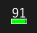

Battery status indicator for Windows 11



## Register startup

- Install dependencies

    ```powershell
    pip install -r requirements.txt
    ```

- Place `battstray.pyw` in any directory
- Edit `battstray.bat`
    - Specify placed path
- Place `battstray.bat` in `%AppData%\Microsoft\Windows\Start Menu\Programs\Startup` (shell:StartUp)

## Environment
Windows 11 23H2
